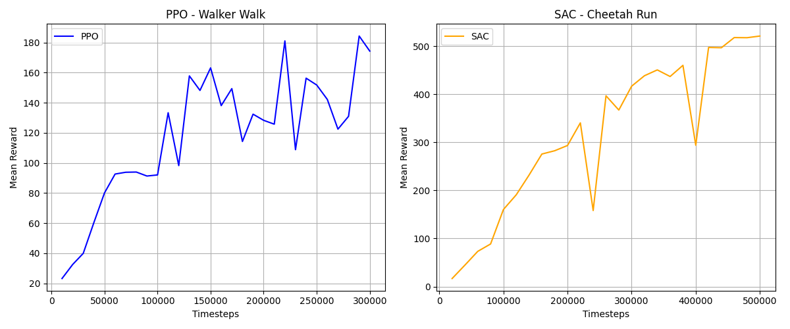

# Efficient Model-Based Reinforcement Learning with Structured State-Space World Models

> B.Tech AIML — Reinforcement Learning Course Project  
> Platform: macOS (Apple Silicon M4) · Python 3.13 · MuJoCo 3.5 · Stable-Baselines3

---

## Project Overview

This project evaluates whether structured state-space (SSM-inspired) dynamics models can improve planning stability and sample efficiency in **TD-MPC2**, compared to standard MLP-based dynamics, under consumer-grade hardware constraints.

The focus is on **state-based continuous control tasks** in MuJoCo via DeepMind Control Suite (dm_control), with PPO and SAC as model-free baselines.

---

## Environments

| Environment | Task | Obs Shape | Action Shape |
|-------------|------|-----------|--------------|
| Walker | walk | (24,) | (6,) |
| Cheetah | run | (17,) | (6,) |
| Hopper | hop | (15,) | (4,) |

All environments use **state observations only** (no pixels).

---

## Project Structure

```
rl/
├── env_setup.py               # dm_control → Gymnasium wrapper (no dmc2gym)
├── train_ppo_mac.py           # PPO baseline (walker_walk, 300k steps)
├── train_sac_mac.py           # SAC baseline (cheetah_run, 500k steps)
├── plot_results.py            # Matplotlib learning curves (PPO + SAC + TD-MPC2)
├── requirements.txt           # All dependencies
├── Figure_1_rl.png            # PPO + SAC baseline learning curves
├── logs/
│   ├── ppo_walker_mac/        # PPO checkpoints + eval logs
│   ├── sac_cheetah_mac/       # SAC checkpoints + eval logs
│   └── tdmpc2_walker_mac/     # TD-MPC2 checkpoints + results
├── tdmpc2/
│   └── tdmpc2/
│       ├── train_tdmpc2_mac.py   # TD-MPC2 training script
│       └── envs/
│           └── dmcontrol_env.py  # dm_control env bridge for TD-MPC2
└── README.md
```

---

## Implementation Progress

| Step | Description | Status |
|------|-------------|--------|
| 1 | MuJoCo + dm_control setup, PPO & SAC baselines | ✅ Done |
| 2 | TD-MPC2 MLP baseline (world model + MPPI planner) | ✅ Done |
| 3 | SSM dynamics integration (Student C) | 🔲 Pending |
| 4 | Multi-seed experiments + final comparison plots | 🔲 Pending |

---

## Setup (Apple Silicon — M4 Mac)

### Prerequisites

```bash
/bin/bash -c "$(curl -fsSL https://raw.githubusercontent.com/Homebrew/install/HEAD/install.sh)"
brew install python glfw git
```

### Create Virtual Environment

```bash
python3 -m venv rl-env
source rl-env/bin/activate
pip install --upgrade pip setuptools wheel
```

### Install Dependencies

```bash
# Core RL and physics
pip install torch torchvision torchaudio
pip install "stable-baselines3[extra]" gymnasium
pip install numpy matplotlib seaborn pandas
pip install mujoco
pip install --no-deps dm_control
pip install dm-env dm-tree glfw lxml scipy requests pyopengl
pip install "shimmy[dm-control]"

# TD-MPC2 dependencies
pip install hydra-core omegaconf
pip install tensordict torchrl einops moviepy imageio
```

> **Note:** `labmaze` is intentionally skipped — it requires Bazel and is not needed for Walker, Cheetah, or Hopper tasks.

### Verify Installation

```bash
python3 - <<'PY'
import torch, mujoco, stable_baselines3
from env_setup import make_env
print("Torch:", torch.__version__, "| MPS:", torch.backends.mps.is_available())
print("MuJoCo:", mujoco.__version__)
env = make_env("walker", "walk")
obs = env.reset()
print("env OK — obs shape:", obs.shape)
PY
```

Expected output:
```
Torch: 2.10.0 | MPS: True
MuJoCo: 3.5.0
env OK — obs shape: (1, 24)
```

---

## Environment Wrapper

Since `dmc2gym` is incompatible with NumPy 2.0 and Python 3.13, a custom wrapper talks directly to `dm_control`:

```python
# env_setup.py
class DMCWrapper(gym.Env):
    # Wraps dm_control suite.load() into a Gymnasium-compatible API
    # Supports reset(), step(), observation_space, action_space
```

---

## Step 1 — PPO & SAC Baselines

### PPO Baseline (Walker — Walk)

```bash
python3 train_ppo_mac.py
```

| Setting | Value |
|---------|-------|
| Algorithm | PPO |
| Environment | walker_walk |
| Total timesteps | 300,000 |
| Learning rate | 3e-4 |
| n_steps | 2048 |
| batch_size | 64 |
| n_epochs | 10 |
| Device | MPS (Apple Silicon) |

### SAC Baseline (Cheetah — Run)

```bash
python3 train_sac_mac.py
```

| Setting | Value |
|---------|-------|
| Algorithm | SAC |
| Environment | cheetah_run |
| Total timesteps | 500,000 |
| Learning rate | 3e-4 |
| buffer_size | 500,000 |
| batch_size | 256 |
| Device | MPS (Apple Silicon) |

### Baseline Results



*Left: PPO on Walker-Walk (300k steps) — Right: SAC on Cheetah-Run (500k steps)*

#### PPO — Walker Walk

- **Early phase (0–50k steps):** Reward rises rapidly from ~20 to ~90, agent quickly learns basic locomotion.
- **Mid phase (50k–150k steps):** Reward reaches ~160. High variance is typical for PPO's on-policy updates — each update discards old data, causing oscillations.
- **Late phase (150k–300k steps):** Noisy upward trend, peaking at **~184** at 290k steps, finishing at **~174**.
- **Overall:** Moderate performance with high variance — weaker baseline compared to off-policy methods.

#### SAC — Cheetah Run

- **Early phase (0–100k steps):** Steep climb from ~0 to ~300, demonstrating SAC's off-policy sample efficiency.
- **Mid phase (100k–300k steps):** Dip to ~150 at ~250k steps (temporary policy collapse), recovers to ~450.
- **Late phase (300k–500k steps):** Second dip at ~400k followed by strong recovery to **~530**.
- **Overall:** SAC reaches ~530, nearly **3× higher than PPO's ~180**.

#### Comparison

| Metric | PPO (Walker) | SAC (Cheetah) |
|--------|-------------|---------------|
| Final reward | ~174 | ~530 |
| Peak reward | ~184 | ~530 |
| Convergence stability | Low (high variance) | Medium (two dips, strong recovery) |
| Sample efficiency | Lower | Higher |
| Training time | ~18 min (300k steps) | ~120 min (500k steps) |

---

## Step 2 — TD-MPC2 MLP Baseline

TD-MPC2 is a model-based RL algorithm that learns a latent world model and uses Model Predictive Path Integral (MPPI) planning to select actions. This step implements the MLP dynamics version as the baseline before replacing the dynamics with an SSM.

### Architecture

| Component | Description |
|-----------|-------------|
| Encoder | obs (24) → latent (64) via MLP + LayerNorm + Mish |
| Dynamics | (latent + action) → next latent — **MLP-based** |
| Reward head | (latent + action) → scalar reward |
| Value head | latent → scalar value (TD target) |
| Policy head | latent → action mean (Tanh) |

### MPPI Planner

At each step, MPPI samples 512 action sequences of length H=5, rolls them out in the learned world model, scores them by cumulative discounted reward + terminal value, and returns the best first action. Elite-based refinement (64 elites) iterates 6 times per step.

### Run TD-MPC2

```bash
PYTHONPATH=/Users/srivaishnavikodali/Desktop/sem_6/rl python3 tdmpc2/tdmpc2/train_tdmpc2_mac.py
```

### TD-MPC2 Hyperparameters

| Setting | Value |
|---------|-------|
| Environment | walker_walk |
| Total timesteps | 300,000 |
| Latent dim | 64 |
| Hidden dim | 128 |
| Planning horizon | 5 |
| MPPI samples | 512 |
| MPPI elites | 64 |
| MPPI iterations | 6 |
| Warmup steps | 5,000 |
| batch_size | 256 |
| buffer_size | 500,000 |
| Device | MPS (Apple Silicon) |

### TD-MPC2 Results (Walker — Walk)

| Timesteps | Eval Reward |
|-----------|-------------|
| 230,000 | 41.8 |
| 240,000 | 43.5 |
| 250,000 | 46.4 (best) |
| 260,000 | 40.4 |
| 300,000 | 40.0 |

Best eval reward: **46.4**

> Note: TD-MPC2 with MLP dynamics converges slower than SAC on this task. This is expected — the MLP dynamics model requires more data to learn accurate latent transitions. The SSM variant (Step 3) is expected to improve this significantly.

---

## Plot All Results

After all training runs are complete:

```bash
python3 plot_results.py
```

Saves combined learning curves to `./logs/all_results.png`.

---

## Hardware

| Component | Spec |
|-----------|------|
| Device | MacBook Air M4 |
| Backend | Apple Metal (MPS) |
| RAM | 16 GB |
| Python | 3.13 |
| MuJoCo | 3.5.0 |
| PyTorch | 2.10.0 |

---

## Work Division

| Student | Responsibility | Status |
|---------|---------------|--------|
| B | MuJoCo / dm_control setup, PPO & SAC baselines | ✅ Done |
| A | TD-MPC2 MLP baseline, world model, MPPI planner | ✅ Done |
| C | SSM dynamics implementation, parameter matching | 🔲 Pending |
| D | Experiment execution, plotting, analysis, report | 🔲 Pending |

---

## Known Issues & Fixes

| Issue | Fix Applied |
|-------|-------------|
| `labmaze` fails to build (requires Bazel) | Installed `dm_control` with `--no-deps` |
| `dmc2gym` incompatible with NumPy 2.0 | Replaced with custom `DMCWrapper` |
| `gym.envs.registry.env_specs` removed | Patched `dmc2gym/__init__.py` |
| TensorBoard broken on Python 3.13 + NumPy 2.0 | Using `plot_results.py` with matplotlib |
| `gym-dmcontrol` not available for Python 3.13 ARM | Replaced with `dmc2gym` from GitHub |
| `hydra` from GitHub fails on Python 3.13 (`pkg_resources`) | Used `pip install hydra-core` from PyPI instead |
| TD-MPC2 can't find `env_setup` module | Run with `PYTHONPATH=/path/to/rl python3 ...` |

---

## Next Steps

- [ ] SSM dynamics implementation — replace MLP dynamics in WorldModel with structured state-space layer (Student C)
- [ ] Ablation: planning horizon 5 vs 10
- [ ] Multi-seed experiments (3 seeds each)
- [ ] Final comparison: PPO vs SAC vs TD-MPC2 (MLP) vs TD-MPC2 (SSM)
- [ ] Report and plots

---

## References

- [MuJoCo](https://mujoco.org/)
- [DeepMind Control Suite](https://github.com/google-deepmind/dm_control)
- [Stable-Baselines3](https://stable-baselines3.readthedocs.io/)
- [TD-MPC2 Paper](https://arxiv.org/abs/2310.16828)
- [TD-MPC2 Website](https://www.tdmpc2.com/)
- [PPO Paper — Schulman et al. 2017](https://arxiv.org/abs/1707.06347)
- [SAC Paper — Haarnoja et al. 2018](https://arxiv.org/abs/1801.01290)
- [MPPI — Williams et al. 2017](https://arxiv.org/abs/1707.02342)
- [GAE Paper — Schulman et al. 2015](https://arxiv.org/abs/1506.02438)
